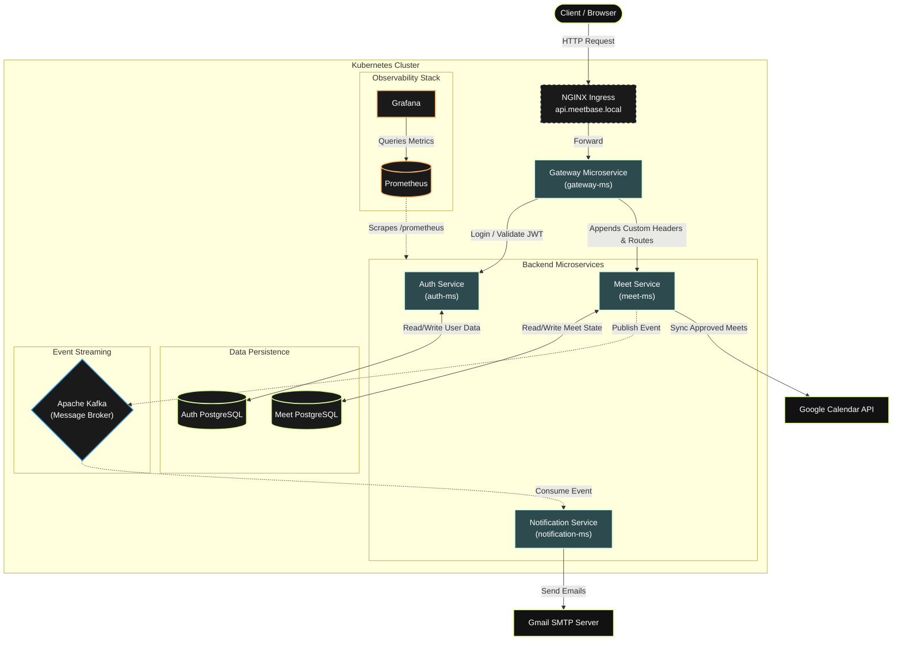

# MeetBase Platform 🎓

MeetBase is an enterprise-grade, event-driven microservices platform designed for educational companies. It provides a centralized system to manage the entire lifecycle of classes—from the initial proposal by a manager to the final automated booking on Google Calendar.

## 🏗️ System Architecture



---

## 🛠️ Microservices Breakdown

### **Gateway Service** (`gateway-ms`)

* **Validates** JWT via custom filters.
* **Injects** `role`, `email`, and `companyID` into headers for downstream authorization.
* **Routes** traffic to the appropriate backend services.

### **Auth Service** (`auth-ms`)

* **Handles** secure Login and Registration (BCrypt password encoding).
* **Issues** JWTs with custom role claims.
* **Exposes** internal endpoints for the Notification Service to fetch user emails by ID or Company Role.

### **Meet Service** (`meet-ms`)

* **Manages** complex state machine transitions (`CREATED` $\rightarrow$ `PENDING` $\rightarrow$ `APPROVED`).
* **Tracks** student registration thresholds (`min_stud_count`).
* **Publishes** asynchronous lifecycle events to Kafka.
* **Syncs** approved meetings directly to Google Calendar.

### **Notification Service** (`notification-ms`)

* **Consumes** Kafka event streams asynchronously.
* **Triggers** user alerts without blocking the main business workflows.
* **Delivers** emails dynamically using a Gmail SMTP server integration.

---

## 🔄 Core Business Workflow (The State Machine)

1. **Creation:** A `Manager` creates a class and sets a `min_stud_count`. The state is set to `CREATED`.
2. **Assignment:** A notification is sent to the assigned `Lecturer`. If accepted, the state shifts to `PENDING`. (If rejected, `CANCELLED`).
3. **Registration:** The meeting becomes visible to `Students`. As students register, the system tracks the count.
4. **Threshold Met:** Once `registered_students == min_stud_count`, an automated Kafka event notifies the Managers that the meeting is ready for approval.
5. **Approval & Sync:** The `Manager` approves the meet. The state becomes `APPROVED`, the Meet Service generates a Google Calendar Hangout link, saves the state, and fires a final notification to all participants.

---

## 📊 Observability & Metrics

MeetBase is fully instrumented for production-grade monitoring using **Spring Boot Actuator**, **Prometheus**, and **Grafana**.

**Custom Business Metrics Tracked:**

* `business.meet.created`: Tracks total meetings initialized.
* `business.failed.meet.approved`: Tracks approval failures (business rule violations or Google API crashes).
* `business.failed.meet.cancel`: Tracks failures to remove external Google events upon cancellation.
* `business.failed.email.fetch`: Tracks internal communication failures between `notification-ms` and `auth-ms`.
* `business.failed.notification.send`: Tracks SMTP delivery failures.


---

## 🚀 Getting Started

### Prerequisites

* Docker and Docker Compose
* Google Calendar API Credentials (`google-credentials.json`)
* Gmail App Password (for SMTP)

### Running the Stack

The entire infrastructure and microservices stack is containerized and orchestrated via Docker Compose.

1. Clone the repository.
2. Ensure your environment variables (like `MAIL_USERNAME` and JWT Secrets) are configured in the `docker-compose.yml`.
3. Boot the cluster:

```bash
docker-compose up -d --build

```

### Access Points

* **Main API Gateway:** `http://localhost:8000`
* **Kafka UI:** `http://localhost:8081`
* **Prometheus:** `http://localhost:9090`
* **Grafana:** `http://localhost:3000` *(Default Login: admin / admin)*# MeetBase
